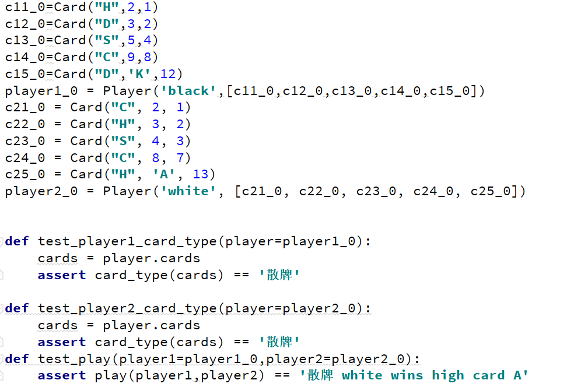
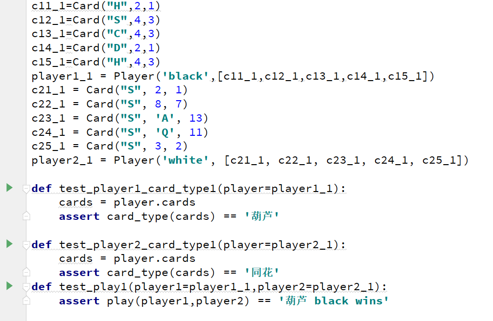
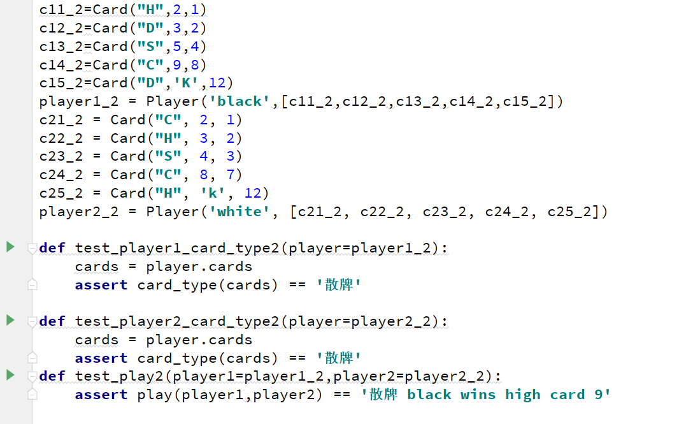
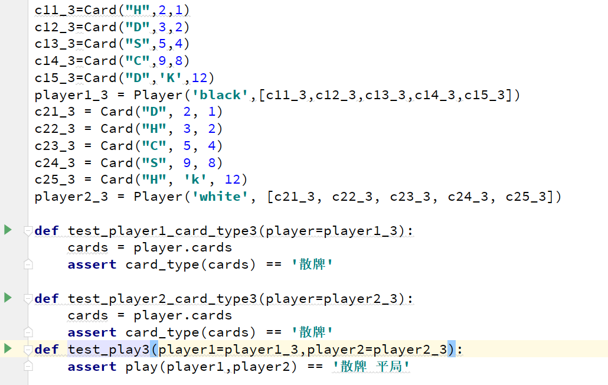
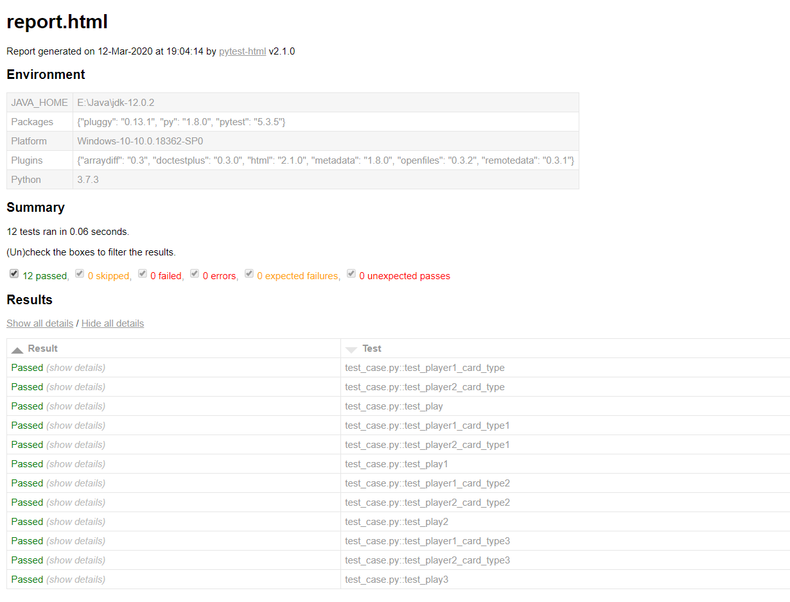

# 德州扑克
## 作业内容
一副扑克有52张牌，每张牌由一个花色和一个数字构成。  
花色为以下四者之一：  
> 方片 D  
> 黑桃 S  
> 红桃 H  
> 梅花 C  

数字为以下13者之一，且大小顺序如下：  
> 2, 3, 4, 5, 6, 7, 8, 9, T, J, Q, K, A  

花色是大小无序的，但数字有序，2最小，A最大。  
一手牌有5张。根据花色和数字的不同，其大小按照以下规则决定。  
满足下面规则的手牌会大于满足上面规则的手牌。  
> 同花顺＞铁支＞葫芦＞同花＞顺子＞三条＞两对＞对子＞散牌  

1.散牌  
&nbsp;&nbsp;&nbsp;&nbsp;&nbsp;&nbsp;不符合其他任何规则的五张牌。 比较最大一张牌的大小，如果相同，比较第二大的牌的牌点数，如果五张牌的牌点数都相同，则为平局  

2.对子：  
&nbsp;&nbsp;&nbsp;&nbsp;&nbsp;&nbsp;有两张同样大小的牌片。 比较两张大小一样的牌的牌点数，如果相同，依次比较剩余的三张牌大小。若大小都相同，则为平局。  

3.两对:  
&nbsp;&nbsp;&nbsp;&nbsp;&nbsp;&nbsp;有两个对子牌。 比较大对子的大小，若相同，比较小对子的大小，若还相同，比较单张牌的大小，若还相同，则为平局。  

4.三条：  
&nbsp;&nbsp;&nbsp;&nbsp;&nbsp;&nbsp;有三张同样大小的牌片。 比较三张大小一样的牌的牌点数大小。  

5.顺子：  
&nbsp;&nbsp;&nbsp;&nbsp;&nbsp;&nbsp;五张相连的牌。 比较最大的牌点数。若大小都相同，则为平局。  

6.同花：  
&nbsp;&nbsp;&nbsp;&nbsp;&nbsp;&nbsp;五张牌的花色相同。 按照散排规则比较大小。  

7.葫芦：  
&nbsp;&nbsp;&nbsp;&nbsp;&nbsp;&nbsp;三条+对子。 比较三张大小一样的牌的牌点数。  

8.铁支：  
&nbsp;&nbsp;&nbsp;&nbsp;&nbsp;&nbsp;有四张同样大小的牌片。 比较四张大小一样的牌的牌点数。  

9.同花顺:  
&nbsp;&nbsp;&nbsp;&nbsp;&nbsp;&nbsp;同一种花色的顺子。 比较最大的牌的牌的大小。若大小都相同，则为平局。  

你的工作是为两手牌判断大小。  
例如：  
输入: Black: *2H 3D 5S 9C KD* White: *2C 3H 4S 8C AH* 输出: White wins - high card: Ace  
输入: Black: *2H 4S 4C 2D 4H* White: *2S 8S AS QS 3S* 输出: Black wins - full house   
输入: Black: *2H 3D 5S 9C KD* White: *2C 3H 4S 8C KH* 输出: Black wins - high card: 9   
输入: Black: *2H 3D 5S 9C KD* White: *2D 3H 5C 9S KH* 输出: Tie   

## 实验结果
基于Python实现，使用到了pytest测试工具  
### 结果截图

###测试数据及单元测试集
分别测试了5张牌的规则和最终的结果  
测试数据  

测试一

测试二

测试三

测试四

测试结果报表

  